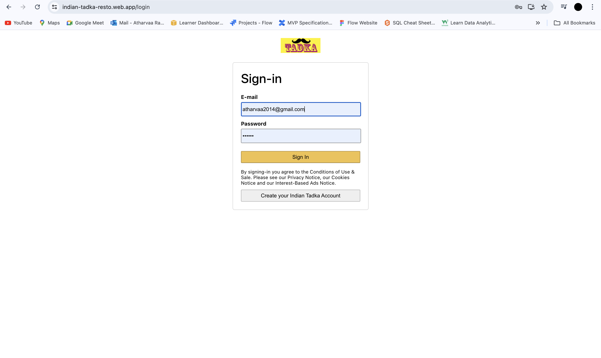
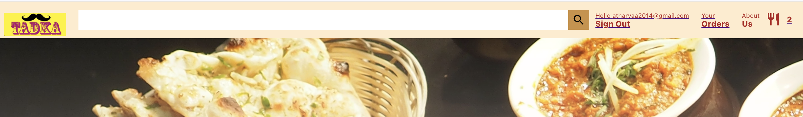
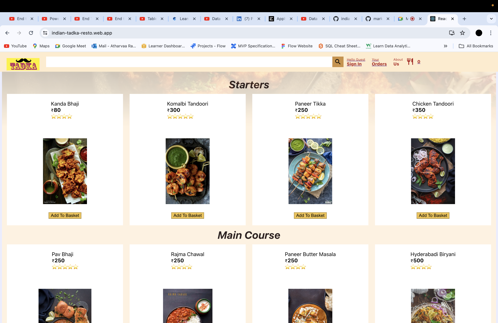
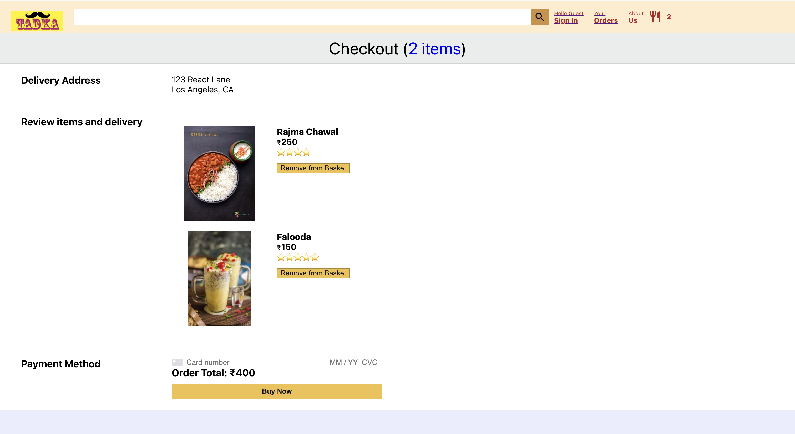

# Indian Tadka Restaurant App

Welcome to the Indian Tadka Restaurant App! This project is a web application for an Indian restaurant, allowing users to browse the menu, add items to their basket, and proceed to checkout. The app is built using ReactJS and Firebase.

# Table of Contents
- [Demo](#demo)
- [Features](#features)
- [Technologies](#technologies)
- [Installation](#installation)
- [Usage](#usage)
- [Screenshots](#screenshots)

## Demo

Check out the live demo of the project: Indian Tadka Restaurant App

## Features

-	User authentication (Sign in/Sign up)
-	Browse menu items
-	Add items to the basket
-	Remove items from the basket
-	Proceed to checkout
-	Display order summary and total cost

## Technologies

-	ReactJS
-	Firebase Authentication
-	Firebase Firestore
-	Firebase Hosting

## Installation

1.	Clone the repository:
```
git clone https://github.com/atharvaa27/indian-tadka_reactapp.git
cd indian-tadka_reactapp
```
2.	Install the dependencies:
```
npm install
```
3.	Set up Firebase:
	-	Create a Firebase project at Firebase Console
	-	Add your Firebase configuration to a .env file in the root of the project:
```
  REACT_APP_FIREBASE_API_KEY=your_api_key
  REACT_APP_FIREBASE_AUTH_DOMAIN=your_auth_domain
  REACT_APP_FIREBASE_PROJECT_ID=your_project_id
  REACT_APP_FIREBASE_STORAGE_BUCKET=your_storage_bucket
  REACT_APP_FIREBASE_MESSAGING_SENDER_ID=your_messaging_sender_id
  REACT_APP_FIREBASE_APP_ID=your_app_id
```
4.	Start the development server:
```
npm start
```
   The app will be available at http://localhost:3000.
## Usage
-	Open the application in your browser.
-	Sign in or create a new account.
-	Browse through the menu items.
-	Add items to your basket.
-	View your basket and proceed to checkout.

## Screenshots

### Home Page

### Login Page


### Menu Page

### Basket Page

